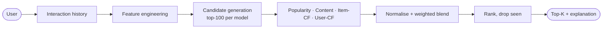

# Hybrid Recommendation Engine

A recommender system built the way it would be built for production: separate **offline** training
and **online** serving, a relational data model, a cache seam for Redis, a leakage-safe evaluation
protocol, per-recommendation explanations, an HTTP API, containers and tests.

It implements and compares four recommenders on the same data:

| Model | Idea |
|---|---|
| **Popularity** | Time-decayed, event-weighted interaction volume. Non-personalised; also the cold-start fallback. |
| **Content-based** | TF-IDF over title/genres/description; cosine similarity to a weighted user profile. |
| **Collaborative** | Item-based and user-based kNN on the user–item matrix (cosine similarity). |
| **Hybrid** | Candidate generation → score normalisation → weighted blend, with history-length-aware weights. |

> **About the data.** The dataset is **synthetic** (generated by `app/services/synthetic_data.py`,
> seed 42): 500 users, 400 items, 9,227 interactions, with a planted taste structure plus noise and
> deliberately cold users/items. I used it because the build environment had no general internet
> access, and it makes the project reproducible offline. Absolute metrics therefore say nothing
> about real-world performance; the value of the numbers is the *relative* comparison and the
> correctness of the pipeline. To use a real dataset (e.g. MovieLens), supply the three CSVs
> described in `app/services/ingestion.py`.

## Quickstart

```bash
pip install -r requirements-dev.txt
python -m training.train        # OFFLINE: ingest → tune → evaluate → fit → precompute (≈20 s, SQLite)
uvicorn app.main:app --port 8000  # ONLINE:  http://localhost:8000/docs
pytest                          # 71 tests (+2 Redis tests that need a live Redis)
```

With Docker (PostgreSQL + one-shot trainer + API):

```bash
docker compose up --build       # API on :8000 once the trainer has finished
```

Shortcuts are in the `Makefile` (`make train`, `make serve`, `make test`, `make evaluate`).
Optional demo UI: `make ui` (Streamlit, talks to the API).

## Project structure

```
app/
├── api/            FastAPI routes
├── models/         SQLAlchemy ORM: users, items, interactions, recommendations
├── database/       engine/session factory (SQLite or PostgreSQL), table creation
├── features/       user / item / interaction features, sparse matrix, UserContext
├── recommenders/   popularity, content, collaborative (item+user kNN), hybrid, registry
├── evaluation/     metrics (P/R/MAP/NDCG@K) and the split/tune/compare runner
├── services/       ingestion, synthetic data, cache, artifacts, offline training, online serving
├── schemas/        Pydantic request/response models
└── main.py         app factory
training/           OFFLINE entry points: train.py, evaluate.py
data/               generate_synthetic.py + raw/*.csv
tests/              pytest suite
docs/               architecture.md (Mermaid), evaluation_results.md (auto-generated)
```

## The recommendation problem

Given a catalogue of items and a log of user–item interactions (views, likes, purchases), produce
for each user a ranked list of K items they have **not yet interacted with** and are likely to
engage with next, and say *why*. The feedback is **implicit** (no ratings): an interaction is a
positive signal whose strength depends on the event type (view=1, like=2, purchase=4) and decays
with age (half-life 120 days). Absence of an interaction does not mean dislike, which is why
ranking metrics are used instead of rating-prediction error.

## Algorithms

**Popularity.** `score(i) = Σ_users weight × 0.5^(age/half-life)`, scaled to [0,1]. Same list for
everyone. It is a strong baseline on long-tailed data and the only sensible answer for a user we know nothing about.

**Content-based.** Item text (title + genres repeated for emphasis + description) → `TfidfVectorizer`
(sublinear TF, English stop-words, 1–2-grams, `min_df=2`). The user profile is the L2-normalised
sum of TF-IDF vectors of their items, weighted by event strength × recency; `score = cosine(profile, item)`.
It needs nothing about the *candidate* item except its text, so it can recommend **brand-new items**.
Its weakness: it only finds items similar to what the user already has (no serendipity) and has no notion of popularity.

**Collaborative filtering.** Operates on the user×item matrix of decayed weights.
- *Item-based:* cosine similarity between item columns, shrunk by co-occurrence support
  (`sim · c/(c+5)`) and pruned to 50 neighbours per item; `score(u,i) = Σ_j r_uj · sim(j,i)`.
- *User-based:* cosine between user rows, keep the 40 nearest users (never the user themself),
  `score(u,i) = Σ_v sim(u,v) · r_vi`.

It captures taste patterns no text could express, but cannot score items with no interactions and is noisy for users with little history.

## Hybrid architecture



1. **Candidate generation** – union of each component's top-100 unseen items.
2. **Normalisation** – each component's scores are min–max scaled over the candidate set, so
   cosine similarities, vote sums and popularity share a scale.
3. **Blend** – `final = Σ_c w_c · norm_c`. Weights are **tuned on a validation split** (grid search,
   step 0.25, NDCG@10) by `training/train.py` and stored in the artifact.
   The search is constrained to `popularity ≤ 0.3` — a deliberate *product* constraint so the hybrid
   stays personalised (see "Honest notes"). Current weights: popularity 0.25, content 0.5, item-CF 0.25, user-CF 0.
4. **History-aware weights** – no history → 100% popularity; fewer than 3 interactions → collaborative
   weights are scaled down proportionally and the freed mass goes to content + popularity.
5. **Explanations** – each item is explained by the strongest *personalised* component that supplies
   ≥25% of its score, naming the user's own past items that support it:
   `Recommended because you interacted with "Last Village" and "Last Magical".`
   Otherwise: `Recommended because it is popular with other users.` A test checks that, for a sample user, every cited title comes from that user's real history.

Full diagrams (offline/online split, request sequence, ER diagram, evaluation protocol): [`docs/architecture.md`](docs/architecture.md).

### Offline vs online

| | OFFLINE (`python -m training.train`) | ONLINE (`uvicorn app.main:app`) |
|---|---|---|
| Runs | on a schedule / on demand, then exits | continuously, stateless |
| Does | ingest, features, tune, evaluate, fit, write artifact, **precompute top-20 for every user into `recommendations`** | load artifact, serve requests |
| Cost | seconds–hours, can be heavy | milliseconds |
| Output | `artifacts/model_bundle.joblib`, `recommendations` rows, `docs/evaluation_results.*` | HTTP responses |

`GET /recommendations/{user_id}` tries **cache → precomputed rows → real-time scoring**. A precomputed
list is used only if it was produced by the currently loaded model version *and* the user has no
interaction newer than the training data; otherwise the user is scored live from their DB history.
`POST /recommendations` is always real-time and accepts anonymous session history.
The response's `source` field (`cache` / `precomputed` / `realtime`) says which path served it.

## API

Interactive docs at `/docs`.

| Endpoint | Purpose |
|---|---|
| `GET /recommendations/{user_id}?k=10&model=hybrid&exclude_seen=true` | Top-K for a user with explanations |
| `POST /recommendations` | Real-time; body `{user_id?, history_item_ids?, k, model, exclude_seen, exclude_item_ids}` — works for anonymous sessions |
| `GET /items/{item_id}/similar?k=10&method=hybrid\|content\|collaborative` | Item-to-item similarity |
| `GET /users/{user_id}/history?limit=50` | Interaction history + top genres |
| `GET /models` | Models, parameters, hybrid weights, version, offline metrics |
| `POST /evaluate` | Re-run the offline comparison on the DB's data (`{k_values, models?, test_frac}`) |
| `GET /health` | Liveness + whether a model is loaded |

```bash
curl "localhost:8000/recommendations/1?k=3"
curl -X POST localhost:8000/recommendations -H 'content-type: application/json' \
     -d '{"history_item_ids":[1,2,3],"k":5}'
curl -X POST localhost:8000/evaluate -H 'content-type: application/json' -d '{"k_values":[10]}'
```

Errors: `404` unknown user/item, `400` unknown model, `422` invalid parameters, `503` no trained model yet.

## Evaluation

**Protocol** (`app/evaluation/runner.py`): per-user *temporal* leave-last-out. For each user with ≥5
interactions the latest 20% are TEST, the 10% before that VALIDATION, the rest TRAIN. Hybrid weights
are tuned on VALIDATION with models fit on TRAIN; the final comparison fits on TRAIN+VALIDATION and
is scored on TEST, which tuning never sees. Features are built only from the fit data (a test checks that no
held-out pair appears in the matrix). Already-seen items are excluded from recommendations, and every model is scored on
the **same 485 users**. A uniform-random recommender is included as a floor.

**Metrics** (`app/evaluation/metrics.py`, hand-verified in `tests/test_metrics.py`), binary relevance:
- **Precision@K** = hits / K (a short list is penalised)
- **Recall@K** = hits / |relevant|
- **MAP@K** = mean over users of AP@K = Σ P@i·rel_i / min(|relevant|, K)
- **NDCG@K** = DCG / ideal DCG, gain 1, discount 1/log₂(rank+1)

Also reported: **catalogue coverage@K** (share of the catalogue that ever gets recommended) and the **standard error** across users.

**Results, K=10, test split** (mean ± standard error; produced by `python -m training.train`, full tables for K=5/10/20 in [`docs/evaluation_results.md`](docs/evaluation_results.md)):

| model | precision@10 | recall@10 | map@10 | ndcg@10 | coverage@10 |
|---|---|---|---|---|---|
| random | 0.0109 ±0.0015 | 0.0307 ±0.0050 | 0.0114 ±0.0022 | 0.0228 ±0.0036 | 1.0000 |
| popularity | 0.0309 ±0.0025 | 0.0787 ±0.0070 | 0.0253 ±0.0030 | 0.0555 ±0.0050 | 0.0625 |
| content | 0.0237 ±0.0021 | 0.0603 ±0.0063 | 0.0166 ±0.0022 | 0.0396 ±0.0041 | 0.9950 |
| cf_item | 0.0355 ±0.0029 | 0.0859 ±0.0075 | 0.0308 ±0.0034 | 0.0640 ±0.0056 | 0.6675 |
| cf_user | 0.0309 ±0.0024 | 0.0811 ±0.0074 | 0.0287 ±0.0034 | 0.0595 ±0.0054 | 0.7100 |
| **hybrid** | **0.0402 ±0.0030** | **0.1020 ±0.0081** | **0.0368 ±0.0035** | **0.0759 ±0.0060** | 0.8025 |

### Honest notes on these numbers

- **Absolute values are low** because the task is hard in this setting: ~19 interactions per user over 400
  items, with ~4 test items per user, and a large popularity effect baked into the generator.
  Only the ordering is meaningful.
- **Hybrid is best on every metric at K=5/10/20, but its lead over item-CF is modest**: NDCG@10 0.0759 vs
  0.0640 with a standard error of ≈0.006 each. It is clearly above popularity, content and random; the gap to
  item-CF is suggestive, not established. I have not run a paired significance test.
- **Content-based is below popularity here.** The generator makes popularity a strong driver of behaviour and
  content ignores it. Its value shows in coverage (it reaches ~99% of the catalogue) and in cold items — which
  is why the hybrid uses it.
- **Weight tuning is noisy.** The validation split has only ~940 interactions. An unconstrained search on it
  chose a 50%-popularity blend that also gave item-CF zero weight, even though item-CF was the best single model on the test split; I added the
  `popularity ≤ 0.3` constraint to keep the hybrid personalised. The test NDCG@10 was 0.0759 both with and
  without the cap, i.e. the data could not distinguish them. That cap is a design decision, not something
  the metrics demanded.
- Results are deterministic (seeded data, deterministic tie-breaking). Running the pipeline on PostgreSQL gave the same tuned weights and the same hybrid NDCG@10 (0.0759) as SQLite.

## Cold-start

| Case | Handling | Where |
|---|---|---|
| **New user, no history** | Hybrid collapses to popularity; explanation says so | `HybridRecommender.effective_weights`, tested |
| **Very short history (1–2 items)** | CF weights scaled down by `n/3`; mass moved to content + popularity | same |
| **Anonymous / session user** | `POST /recommendations` with `history_item_ids` builds a context on the fly | `Features.context_from_history`, tested |
| **New item, no interactions** | Content similarity can recommend it; CF scores it 0. Item-to-item falls back to content only | tested (`test_hybrid_can_surface_cold_items`) |
| **New user, no history, and personalisation wanted** | *Not implemented* — would need onboarding preference capture or contextual bandits | — |

The synthetic data deliberately contains 15 cold users and 20 cold items so these paths run in the tests and in the API.

## Scalability considerations

What is here is sized for ~10⁴ users / 10³ items and is honest about it:

- Item-CF stores a dense `n_items × n_items` float32 matrix (fine to ≈20k items). Beyond that: store only top-N neighbours per item as a sparse matrix, or use ANN (FAISS/ScaNN/HNSW) on item embeddings.
- User-CF scores against all users per request (O(users)). At scale, replace with ANN over user vectors or factorisation (ALS / implicit-feedback MF, two-tower embeddings).
- Candidate generation + ranking is already two-stage; the natural upgrade is a learned ranker (LightGBM/LambdaRank) over the features in `app/features`, with the current blend as one input.
- **Offline precomputation** moves the heavy work off the request path; shard the batch job by user id range and write to the table in bulk. Real-time scoring is the fallback, not the main path.
- **Caching:** the serving layer depends only on `CacheBackend`; `RECSYS_CACHE_BACKEND=redis` switches the in-process TTL cache to Redis (verified against a live Redis 
  with `tests/test_redis_cache.py`). Cache keys include the model version, so retraining invalidates them. Trade-off: a cached list can be up to `cache_ttl_seconds` stale after a new interaction.
- The API process is stateless apart from the loaded artifact, so it scales horizontally behind a load balancer; add a model registry/object store instead of a shared volume.
- `POST /evaluate` is synchronous and CPU-bound (~seconds here). At scale it should enqueue a job and return an id.
- Feature computation is pandas/scipy in-memory; for larger data move it to Spark/SQL and a feature store.

## What was verified, and what was not

Verified by running it: the 71 default tests (and the three bug-injection checks I used to confirm
they fail when the code is wrong); the full offline pipeline and live API on SQLite; the same pipeline,
API and `/evaluate` against a real **PostgreSQL 16** instance (identical metrics); the Redis cache against a live **Redis**; `docker compose config` validates.

**Not verified:** the Docker images were never built or run (no Docker daemon in the build environment), and
the Streamlit app was only syntax-checked, and the Mermaid diagrams were written carefully but not rendered. Treat `docker compose up` as unproven until you run it once.
The default test-suite uses in-memory SQLite, not PostgreSQL.

## Known limitations

- Synthetic data only; no tuning of model hyper-parameters (neighbours, shrinkage, TF-IDF settings) was done.
- No endpoint to ingest new interactions; live activity is read from the DB, which something else must populate.
- No authentication/rate limiting on the API.
- The artifact is a pickle (joblib): load only artifacts your own training job produced.
- Business rules (diversity, freshness, availability filters) are absent.

## Future improvements

Learned ranker (LTR) and implicit-feedback matrix factorisation (ALS/BPR); sentence-embedding item vectors instead of TF-IDF;
MMR/diversity re-ranking; position-aware metrics and online A/B evaluation (offline metrics only estimate online impact);
exploration (bandits) for cold-start; an interaction-ingestion endpoint with cache invalidation; async evaluation jobs;
a model registry and scheduled retraining with drift monitoring; significance testing (paired bootstrap) in the evaluation report.
