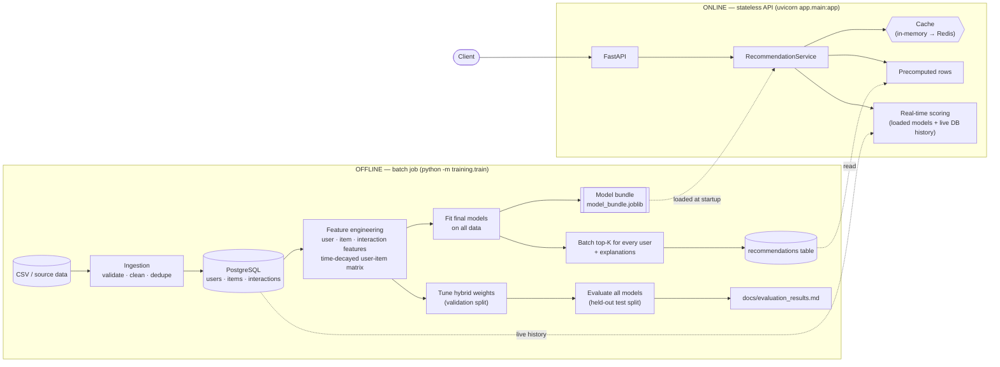
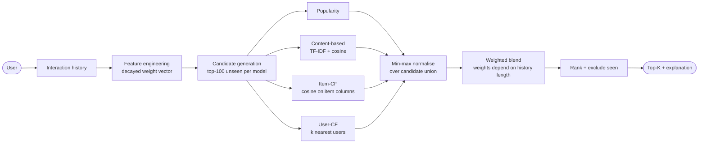
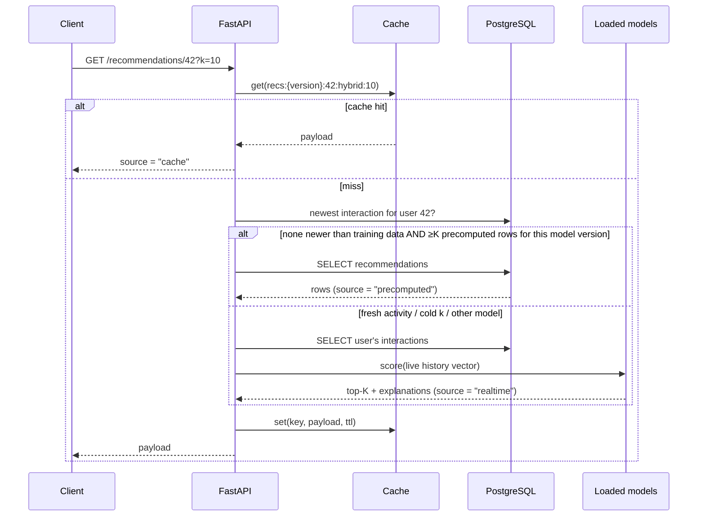
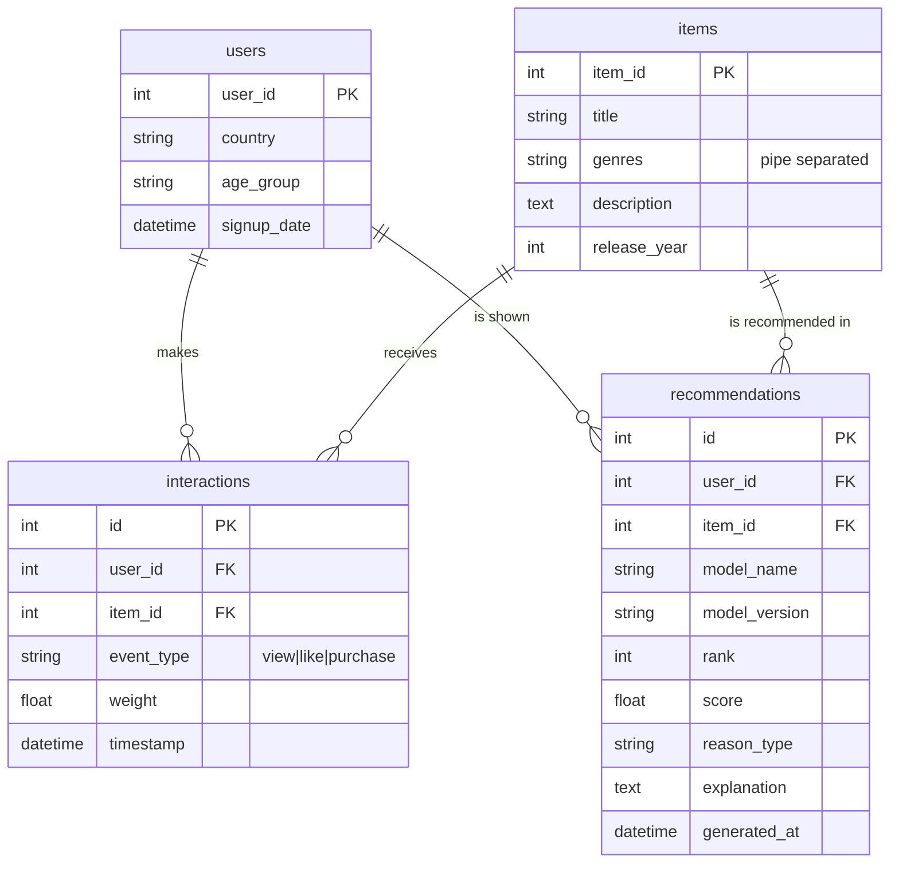
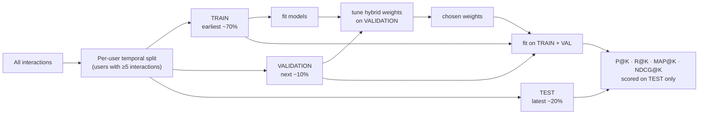

# Architecture

## 1. Offline vs online (the key boundary)

Training and bulk recommendation generation never run inside the API process. The two halves
communicate only through two durable artifacts: the **model bundle** (joblib file) and the
**`recommendations` table**.

## 2. Recommendation pipeline (per request / per batch user)

## 3. Serving a `GET /recommendations/{user_id}` request

## 4. Database schema

`interactions` has a unique constraint on `(user_id, item_id)`: ingestion collapses repeat events
into the strongest event with the latest timestamp.

## 5. Evaluation protocol

